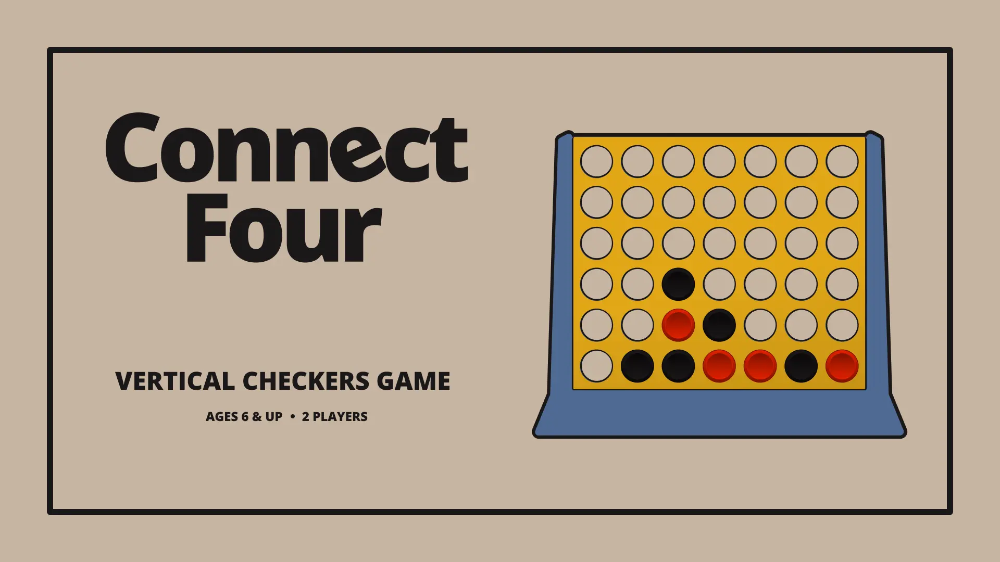

# Connect Four

Classic Connect Four, the vertical checkers game.

## Instructions

1. Be the first to get four checkers in a row: Horizontally, Vertically, or diagonally.
2. Click a column to drop your checker. It falls to the lowest empty spot.
3. If the board fills up with no winner, it’s a tie.

